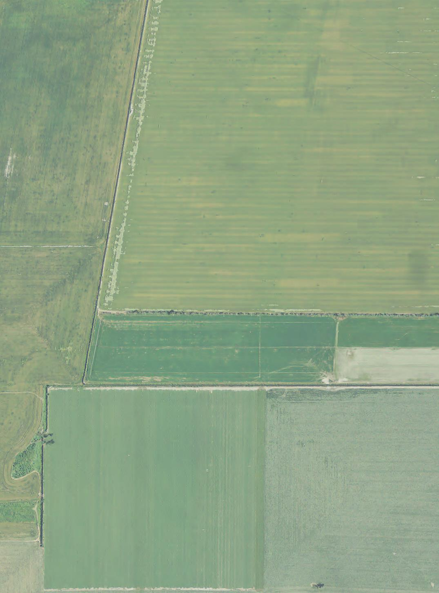
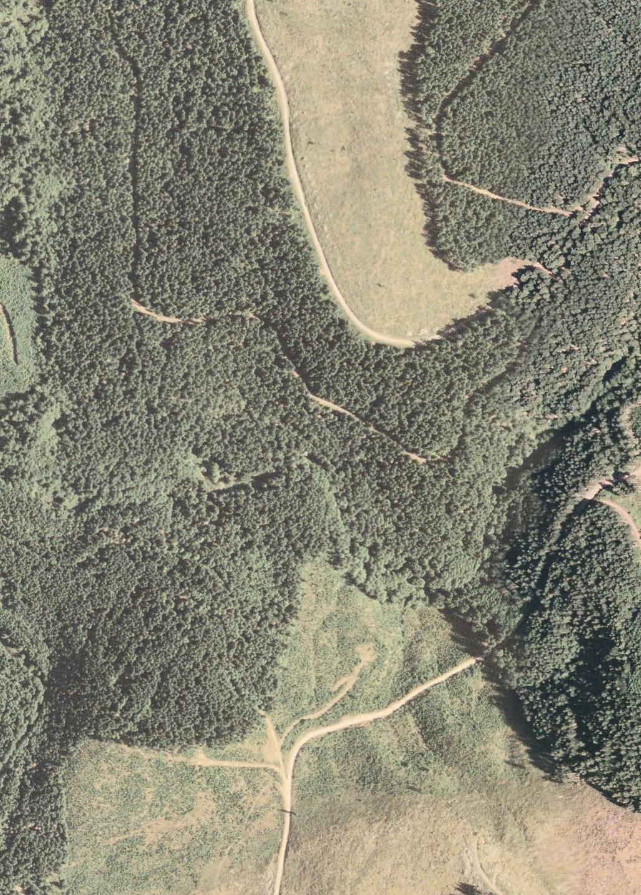

## Samples of final neural net applied to various images from the evaluation set



<iframe width="700" height="500" src="image2_plots.html" frameborder="0"></iframe>





<iframe width="700" height="500" src="image3_plots.html" frameborder="0"></iframe>





<iframe width="700" height="500" src="image4_plots.html" frameborder="0"></iframe>

